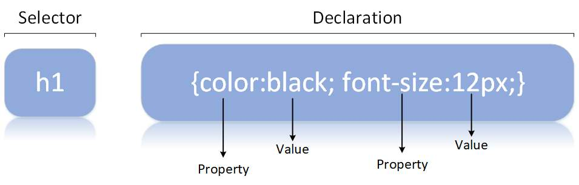

# CSS

## Selectors

- Element(tag) Selector
- ID Selector #ID - unique
- Class Selector .class - not unique
- tag + ID or Class

## Styling Text

## Adding Fonts

## Browser Default Styles

## Commenting

## Colors

## Border & Outline

## Box Model

## Text Align

## Display

## Centering an Image

## Icon

## Styling Links

## Styling Lists

## Styling Tables

## Max-Width

## Position

## Overflow

## Float

## Combinators

## Pseudo-Classes

## Pseudo-Elements

## Styling Forms

## em, rem Units
