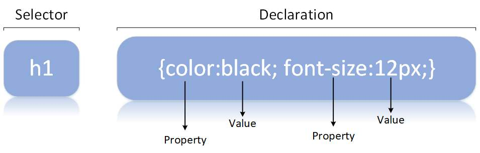
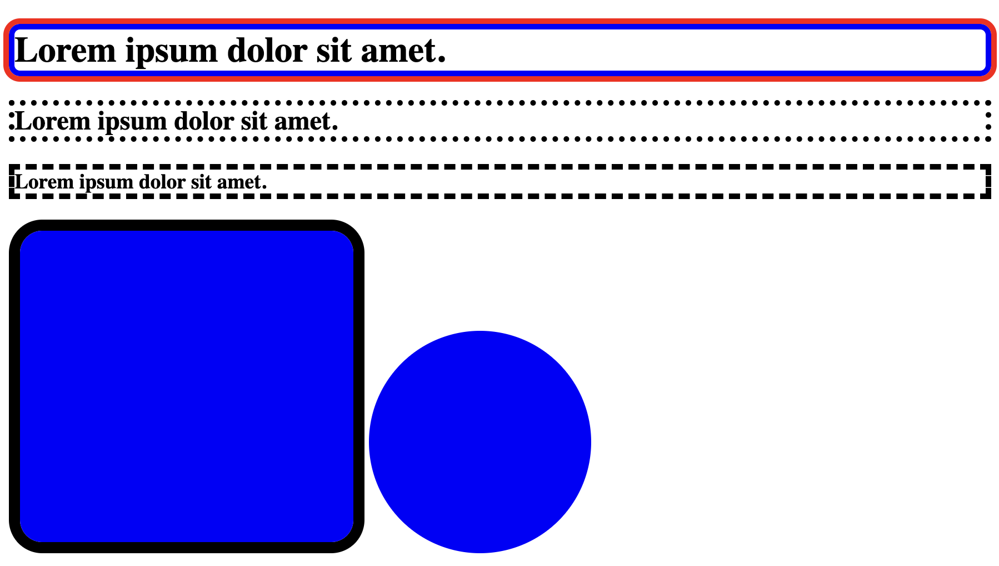
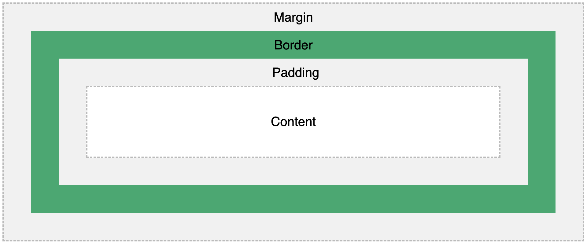

# CSS

## Selectors

- [github](/Learn_CSS/index.html)
- Element(tag) Selector
- ID Selector #ID - unique
- Class Selector .class - not unique
- tag + ID or Class
- Universal Selector (\*)
- Grouping Selector - h1,p,span
- div p : selector selector
- a => cursor:pointer

## Styling Text

- [github](/Learn_CSS/styling_text.htmlLearn_CSS/)
- font-size: 40px;
- font-weight: normal;
- direction: ltr;
- text-decoration: line-through;
- letter-spacing: 10px;
- word-spacing: 10px;
- text-transform: uppercase;
- text-shadow: 2px 2px 5px blue;
- line-height: 40px;

## Adding Fonts

- [github](/Learn_CSS/add_font.html)
- add font
- link: https://fonts.google.com/

## Browser Default Styles

## Commenting

- Start: "/_" End:"_/"
- Command + "/"

## Colors

- [github](/Learn_CSS/colors.html)
- Pre defined colors
- link: https://flatuicolors.com/

## Border & Outline

- [github](/Learn_CSS/border.html)
- border: 5px solid blue;
- outline: 5px solid red;
- border-radius: 10px;
- border: 5px dotted;
- border: 5px dashed;
- border-radius: 30px;
- border-radius: 50%; makes image circule

## Box Model

- [github](/Learn_CSS/box_model.html)
- Padding
- Margin
- Clockwise
- top right bottom left: 10px 15px 20px 5px
- top and bottom right and left: 10px 15px
- border-top
  -border-top-left-radius

## Text Align
- [github](/Learn_CSS/text-align.html)
- text-align: center;

## Display

- [github](/Learn_CSS/display.html)

## Centering an Image

## Icon

## Styling Links

## Styling Lists

## Styling Tables

## Max-Width

## Position

## Overflow

## Float

## Combinators

## Pseudo-Classes

## Pseudo-Elements

## Styling Forms

## em, rem Units
